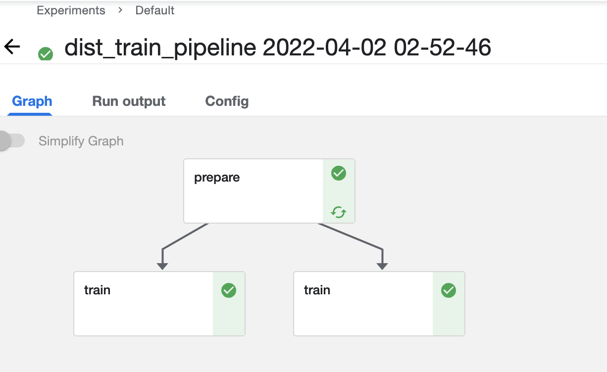

# Kubeflow Pipeline distributed training support

kfp-dist-train contains utilities to use together with
[Kubeflow Pipeline](https://www.kubeflow.org/docs/components/pipelines/)
to enable writing distributed training code directly using Kubeflow Pipeline SDK.

## Get Started

1. Setup an Kubeflow environment (maybe use https://github.com/alauda/kubeflow-chart).
2. Upload the example [kfp-dist-train.ipynb](./kfkp-dist-train.ipynb) into a Notebook
   instance, or setup local pipeline submit.
3. Execute the example to submit a workflow, you can configure the number of workers
   in the Kubeflow web UI. The job should look like below:

# Some Roadmap

- support `kfpdist.component(dist=True)` decorator as an wrap of `dsl.component`
- support parameter server strategy
- support pytorch
